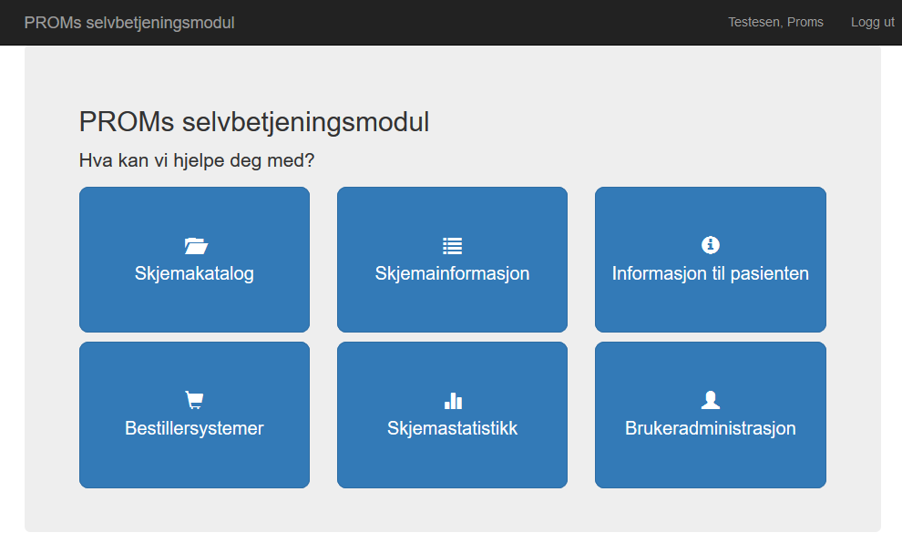
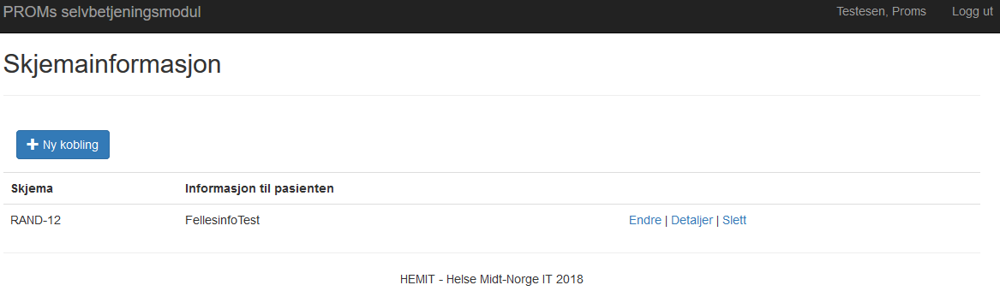
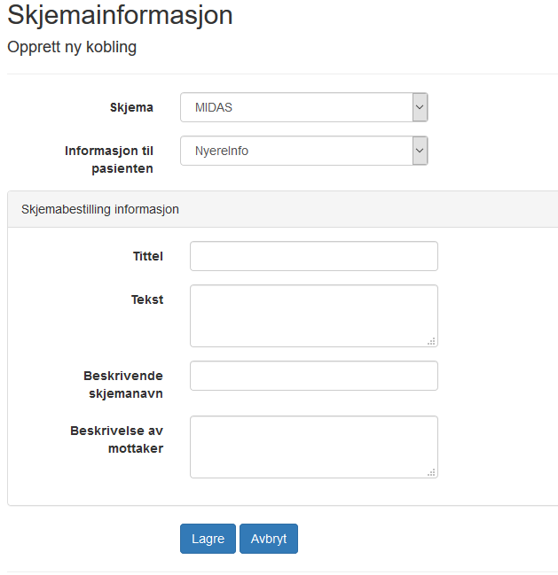

# ePROM Brukerdokumentasjon for selvbetjeningsløsning v0.1

*Gjelder v1.1 av PROMS*

*Sist oppdatert 05.01.2017*

## Hovedmeny
Dashboard for ePROM. Trykk på PROMS Administrasjon eller Hovedmeny øverst til venstre for å komme hit fra hvilken som helst side
 

## Skjemakatalog
Oversikt over tilgjengelige skjema og mulighet for å administrere eksisterende og opprette nye skjema.

Skjema som er tilgjengelige for alle bestillersystemer ligger under Felles, Skjema som kun er tilgjengelig for eget bestillersystem ligger under Mine. Mulig å søke opp Skjema ved å skrive inn hele eller deler av navnet.

Id brukes av bestillersystem ved skjemabestilling for å angi hvilket skjema som skal bestilles.

Status kan være enten Kladd, Publisert eller Trukket tilbake. Skjema kan bare redigeres så lenge de er i Kladd status. Når de har blitt Publisert kan de ikke lenger redigeres, men kan trekkes tilbake. Et skjema som er trukket tilbake kan publiseres på nytt, men kan ikke redigeres. Dette for å hindre at et skjema som er eller har vært publisert kan endres. Skal et skjema endres etter at det er publisert må det opprettes en ny versjon av det.

Skjemaene har følgende mulige aksjoner i de ulike statusene
*	Kladd – Publiser, rediger, lag ny versjon, forhåndsvis, last ned filer
*	Publisert – Trekk tilbake, lag ny versjon, forhåndsvis, last ned filer
*	Trukket tilbake – Publiser, lag ny versjon, forhåndsvis, last ned filer

Forklaring aksjoner
*	Lag ny versjon – Kopierer et eksisterende skjema for å lage en ny versjon
*	Last ned filer – Laster ned en zip-fil med filer for bruk i bestillersystemet. Inneholder skjemadefinisjon og ressursfiler (xsd og resx filer)

## Informasjon til pasienten
Oversikt over tilgjengelige Informasjon til pasienten og mulighet for å administrere eksisterende og opprette nye Informasjon til pasienten.
Informasjon til pasienten er tekst som vises i ønskede skjema (se Informasjon til pasienten kobling)

Informasjon til pasienten som er tilgjengelige for alle bestillersystemer ligger under Felles, Informasjon til pasienten som kun er tilgjengelig for eget bestillersystem ligger under Mine. Mulig å søke opp Informasjon til pasienten ved å skrive inn hele eller deler av navnet. Informasjon til pasienten er primært tenkt brukt til tekst av type disclaimer/ansvarsfraskrivelse og kan gjerne være standardisert tekst som kan gjenbrukes på flere skjema

## Informasjon til pasienten kobling
Oversikt over hvilken Informasjon til pasienten de ulike Skjema er koblet mot.

### Informasjon til pasienten kobling - ny

Velg Skjema og Informasjon til pasienten som skal kobles sammen (dvs. hvilken Informasjon til pasienten som skal vises i hvilket Skjema)

