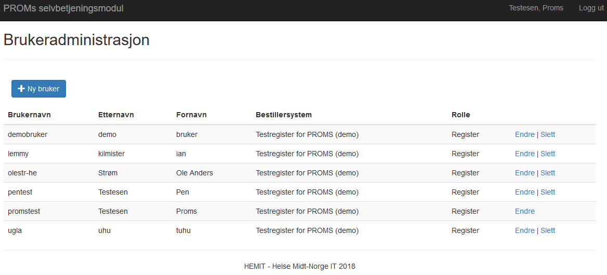

# ePROM Brukerdokumentasjon for selvbetjeningsløsning v0.1

*Gjelder v2.0 av PROMS*

*Sist oppdatert 21.08.2018*

[Skjemakatalog](#skjemakatalog)

[Informasjon til pasienten](#informasjon-til-pasienten)

[Skjemainformasjon](#skjemainformasjon)

[Bestillersystemer](#bestillersystemer)

## Hovedmeny
Dashboard for ePROM. Trykk på PROMS Administrasjon eller Hovedmeny øverst til venstre for å komme hit fra hvilken som helst side
 

## Skjemakatalog
Oversikt over tilgjengelige skjema og mulighet for å administrere eksisterende og opprette nye skjema.

Skjema som er tilgjengelige for alle bestillersystemer ligger under *Felles*, Skjema som kun er tilgjengelig for eget bestillersystem ligger under *Mine*. Mulig å søke opp Skjema ved å skrive inn hele eller deler av navnet.

Id brukes av bestillersystem ved skjemabestilling for å angi hvilket skjema som skal bestilles.

Status kan være enten Kladd, Publisert eller Trukket tilbake. Skjema kan bare redigeres så lenge de er i Kladd status. Når de har blitt Publisert kan de ikke lenger redigeres, men kan trekkes tilbake. Et skjema som er trukket tilbake kan publiseres på nytt, men kan ikke redigeres. Dette for å hindre at et skjema som er eller har vært publisert kan endres. Skal et skjema endres etter at det er publisert må det opprettes en ny versjon av det.

Skjemaene har følgende mulige aksjoner i de ulike statusene
*	Kladd – Publiser, Rediger, Slett, Ny versjon, Forhåndsvis, Last ned
*	Publisert – Trekk tilbake, Ny versjon, Forhåndsvis, Last ned
*	Trukket tilbake – Publiser, Ny versjon, Forhåndsvis, Last ned

Forklaring aksjoner
*	Ny versjon – Kopierer et eksisterende skjema for å lage en ny versjon, og gjøre endringer på det
*	Last ned – Laster ned en zip-fil med filer for bruk i bestillersystemet. Inneholder skjemadefinisjon og ressursfiler (xsd og resx filer)

## Informasjon til pasienten
Oversikt over tilgjengelige *Informasjon til pasienten* og mulighet for å administrere eksisterende og opprette nye *Informasjon til pasienten*.
*Informasjon til pasienten* er tekst som vises i ønskede skjema (se *Informasjon til pasienten* kobling)

*Informasjon til pasienten* som er tilgjengelige for alle bestillersystemer ligger under Felles, *Informasjon til pasienten* som kun er tilgjengelig for eget bestillersystem ligger under Mine. Mulig å søke opp *Informasjon til pasienten* ved å skrive inn hele eller deler av navnet. *Informasjon til pasienten* er primært tenkt brukt til tekst av type disclaimer/ansvarsfraskrivelse og kan gjerne være standardisert tekst som kan gjenbrukes på flere skjema

## Skjemainformasjon
Oversikt over hvilken *Informasjon til pasienten* de ulike Skjema er koblet mot.

### Skjemainformasjon - Opprett ny kobling

Velg Skjema og *Informasjon til pasienten* som skal kobles sammen (dvs. hvilken *Informasjon til pasienten* som skal vises i hvilket Skjema)

## Bestillersystemer
Info om eget bestillersystem

*API nøkkel* brukes av bestillersystem ved skjemabestilling for å identifisere seg selv
API base URL angir url til mottakssystemet for bestillersystemet

### Bestillersystemer - Endre

*Telefon* er telefonnummeret til kontaktperson for bestillersystemet. Sendes med til mottaker av bestillingen (pasienten)

*E-post* er e-post adressen til kontaktperson for bestillersystemet. Sendes med til mottaker av bestillingen (pasienten)

*Trykk* på *Generer* for å generere en ny *API nøkkel*. Denne må i tilfelle også samtidig endres i bestillersystemet. Trykk på *Slett* for å fjerne API nøkkel og gjøre det umulig for bestillersystemet å sende inn flere skjemabestillinger. Generes ny API nøkkel kan bestillersystemet sende inn skjemabestillinger ingjen.

## Skjemastatistikk
Viser oversikt over antall skjemabestillinger og antall utfylte skjema per skjematype. Mulig å søke på statistikk for periode basert på dato

## Brukeradministrasjon
Oversikt over brukere. Mulig å administrere bestillersystemets egne brukere

