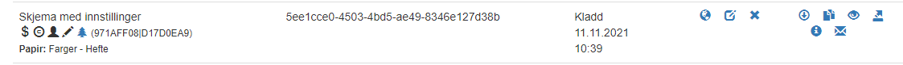

# Brukerdokumentasjon for selvbetjeningsløsning

*Sist oppdatert 11.11.2021*

[Hovedmeny](#hovedmeny)

[Skjemakatalog](#skjemakatalog)

[Informasjon til pasienten](#informasjon-til-pasienten)

[Skjemainformasjon](#skjemainformasjon)

[Bestillersystemer](#bestillersystemer)

[Skjemastatistikk](#skjemastatistikk)

[Brukeradministrasjon](#brukeradministrasjon)

## Hovedmeny
Dashboard for ePROM. Trykk på ePROM selvbetjeningsmodul på menylinjen øverst for å komme hit fra hvilken som helst side
 

## Skjemakatalog
Oversikt over tilgjengelige skjema og mulighet for å administrere eksisterende skjema og opprette nye skjema.

Skjema som er tilgjengelige for alle bestillersystemer ligger under katalogen *Felles*, skjema som kun er tilgjengelig for eget bestillersystem ligger under *Mine*. Det er mulig å søke opp skjema ved å skrive inn hele eller deler av navnet i søkefeltet til høyre.

Under søkefeltet er det også mulig å filtrere listen basert på skjemastatus. Trykk på knappene for å skjule og vise skjema med den aktuelle statusen.

Id brukes av bestillersystem ved skjemabestilling for å angi hvilket skjema som skal bestilles.

Skjema kan ha følgende status:
 - Kladd
 - Publisert
 - Trukket tilbake. 

Skjema kan bare redigeres eller slettes så lenge de er i Kladd-status. Når de har blitt Publisert kan de ikke lenger redigeres eller slettes, men kan trekkes tilbake. Det er mulig å svare på et skjema som er trukket tilbake, men det er ikke mulig å gjøre nye bestillinger av skjemaet. Et skjema som er trukket tilbake kan publiseres på nytt, men kan ikke redigeres. Dette for å hindre at et skjema som er eller har vært publisert kan endres. 

*_NB: Skal et skjema endres etter at det er publisert må det opprettes en ny versjon av det._*

Beskrivelse av ikonene i listen til høyre på bildet over:
* Publiser/trekk tilbake skjema
* Rediger skjema
* Slett - for skjema som ikke har vært publisert
*	Last ned – Laster ned en zip-fil med filer for bruk i bestillersystemet. Inneholder blant annet skjemadefinisjon og ressursfiler (.xsd og .resx filer) og PDF av papirskjema for skjema som er aktivert for papir
*	Ny versjon – Kopierer et eksisterende skjema for å lage en ny versjon av skjemaet, og gjøre endringer på det. Dette skjemaet får en ny Id.
*	Forhåndsvis - viser hvordan skjema vil se ut for mottageren i ePROM skjemautfyller
*	Eksporter skjema (i json-format)
*	Se skjemainformasjon (hvis tilknyttet)
*	Se følgebrev (hvis tilknyttet)

I tillegg kan du for alle skjematyper se skjemainformasjon og følgebrev hvis skjemaet har dette knyttet til seg.

### Samleskjema

Her kommer informasjon om å hvordan man oppretter samleskjema

## Informasjon til pasienten
Oversikt over tilgjengelige *Informasjon til pasienten* og mulighet for å administrere eksisterende og opprette nye *Informasjon til pasienten*.
*Informasjon til pasienten* er følgebrevet som pasienten får sammen med skjemaet. Det kan inneholde utfyllende informasjon om skjemaet, hvem som er avsender, hva som er hensikten og målet med henvendelsen, instrukser om hvordan skjemaet skal fylles ut osv. Dette vises øverst i et enkeltskjema, eller på forsiden av et samleskjema. Et følgebrev kan brukes av mange ulike skjema, men et skjema kan kun ha ett følgebrev.

*Informasjon til pasienten* som er tilgjengelige for alle bestillersystemer ligger under Felles, *Informasjon til pasienten* som kun er tilgjengelig for eget bestillersystem ligger under Mine. Mulig å søke opp *Informasjon til pasienten* ved å skrive inn hele eller deler av navnet. 

## Skjemainformasjon
Skjemainformasjon inneholder blant annet informasjon om hvilke skjema som er knyttet til hvilke følgebrev.
Her defineres også informasjon om selve skjemabestillingen, det vil si informasjonen pasienten skal få i skjemaoppgaven eller brevet til helsenorge, digipost eller eBoks. 

### Skjemainformasjon - Opprett ny kobling

- Velg Skjema som denne skjemainformasjonen skal gjelde for
- Velg *Informasjon til pasienten* (følgebrev) som skal kobles sammen med dette skjemaet
- Fyll ut informasjon om skjemabestilling. Forhåndsvisningen til høyre viser hvordan skjemaoppgaven/brevet vil se ut i hhv helsenorge og digipost (veksle ved å trykke på knappene)

## Bestillersystemer
Info om eget bestillersystem

*API nøkkel* brukes av bestillersystem ved skjemabestilling for å identifisere seg selv.
API base URL angir url til mottakssystemet for bestillersystemet og må oppgis.

### Bestillersystemer - Endre

NB: Når nytt bestillersystem opprettes må følgende informasjon oppgis før bestillersystemet er klart til bruk:
 - *Telefon* er telefonnummeret til kontaktperson for bestillersystemet. Sendes med til mottaker av bestillingen (pasienten)
 - *E-post* er e-post adressen til kontaktperson for bestillersystemet. Dersom denne skal sendes med i kontaktinformasjon til pasienten må det aktiveres av administrator. E-post vil aldri vist på helsenorge, kun andre kanaler.
 - API base URL
 - API-nøkkel

*Trykk* på *Generer* for å generere en ny *API nøkkel*. Denne må i tilfelle også samtidig endres i bestillersystemet. Trykk på *Slett* for å fjerne API nøkkel og gjøre det umulig for bestillersystemet å sende inn flere skjemabestillinger. Generes ny API nøkkel kan bestillersystemet sende inn skjemabestillinger ingjen.

## Skjemastatistikk
Viser oversikt over antall skjemabestillinger og antall utfylte skjema per skjematype. 
 - Mulig å søke på statistikk for periode basert på dato
 - Mulig å laste ned resultat av søk til excel

## Brukeradministrasjon
Oversikt over brukere. Mulig å administrere bestillersystemets egne brukere

[< Tilbake til startsiden](readme)
