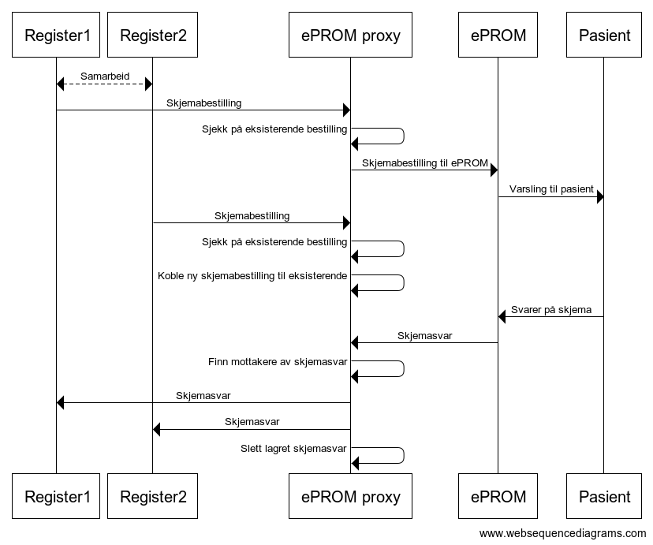
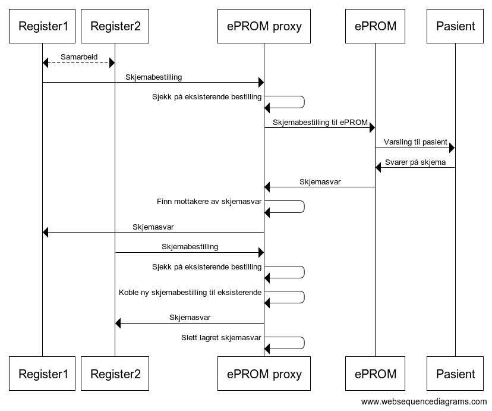

# ePROX 

## Integrasjon

Integrasjon mot ePROX skjer på samme måte som mot ePROM, med unntak av adresse til bestillings-API. 

Integrasjonsguide for ePROM finnes [her](Integrasjonsguide.md)

All kommunikasjon fra registrene går via ePROX mot ePROM

## Bruk av ePROX

Bruk av ePROX baserer seg på at registeret benytter ePROX for alle skjemabestillinger av den aktuelle skjematypen. Registre som er knyttet til samme bestilling vil motta samme statusoppdateringer på bestillingen, både når det gjelder bestilling, svar, utløpsdato og feil.

## Bestilling og svar

### Overordnet flytdiagram

Flytdiagrammet under viser hva som skjer når to registre bestiller samme skjema via ePROX. I dette tilfellet bestiller begge registre skjemaet før pasienten svarer. Begge registre kobles da til samme bestilling mot ePROM, og mottar svaret samtidig når/hvis pasienten velger å svare.  

Flytdiagrammet under viser hva som skjer når to registre bestiller samme skjema via ePROX. I dette tilfellet bestiller register nr 2 skjemaet etter at pasienten har svart på bestillingen fra register 1. Register 2 vil da motta svaret umiddelbart. 

### Bestilling uten relevant dato

En standard bestilling gjøres på samme måte som en bestilling mot ePROM. ePROX vil først lete etter aktive bestillinger** etter følgende regler :
- dersom samme register bestiller samme skjema på samme pasient to eller flere ganger, trigges ny bestilling mot ePROM, selv om det allerede finnes aktive bestillinger på samme pasient og skjema. 
- dersom det finnes en eller flere aktive bestillinger, på samme pasient og samme skjema men fra annet register, skal det ikke trigges en ny bestilling mot ePROM, men bestillingene skal kobles sammen i ePROX. Den nye bestillingen vil kobles til den bestillingen med nyest bestillingsdato og få samme status som denne (bestilt, besvart, utløpt).
- dersom det ikke finnes en aktiv bestilling, på samme pasient og samme skjema, skal det trigges en ny bestilling mot ePROM

### Bestilling med relevant dato (metadata) 

Relevant dato sendes med som metadata til bestillingen. Relevant dato kan være innleggelsesdato, operasjonsdato, ulykkesdato e.l. Denne blir brukt til å avgjøre om det finnes eksisterende bestillinger i ePROX som den nye bestillingen skal kobles til eller hvorvidt det skal trigges en ny bestilling mot ePROM om det ikke finnnes en eksisterende bestilling i ePROX. ePROX vil kun hente ut eksisterende bestillinger med bestillingsdato som er nyere enn relevant dato. 

#### Relevant dato som trigger ny bestilling
_Scenario 1: en pasient med flere tidligere hjerteinfarkt opplever et nytt hjerteinfarkt i mai, men hadde allerede fylt ut skjema knyttet til tidligere hendelse i februar samme år._ 
- I dette tilfellet ønsker ikke registeret nødvendigvis å motta det eksisterende svaret fordi det er utdatert, men det kan hende de ønsker å gjøre en ny bestilling mot ePROM. I dette tilfelles benyttes _RelevantDateCreateNew_. Denne vil trigge ny bestilling dersom det ikke finnes eksisterende svar som tilfredsstiller kravene.

#### Relevant dato som ikke trigger ny bestilling 
_Scenario 2: skjema blir etterregistrert i registeret, slik at fristen for utsending allerede er utløpt i det skjemaet blir registrert._ 
- I dette tilfellet ønsker registeret å motta eksisterende svar om det finnes i ePROX og det ikke er utdatert, men ikke gjøre en ny bestilling mot ePROM om det ikke finnes. I dette tilfellet benyttes _RelevantDateDontCreate_. Denne vil ikke trigge ny bestilling mot ePROM dersom det ikke finnes eksisterende svar som tilfredsstiller kravene.

#### **Hva er en aktiv bestilling?

En aktiv bestilling er en bestilling med en av følgende tilstander: 
- Bestilling med status bestilt hvor bestillingsdato ikke er foreldet (mindre enn 365 dager gammel)
- Bestilling med status utløpt hvor bestillingsdato ikke er foreldet (mindre enn 365 dager gammel)
- Bestilling med status besvart hvor svar ikke er sendt tilbake til alle som kan tenkes å få svar

