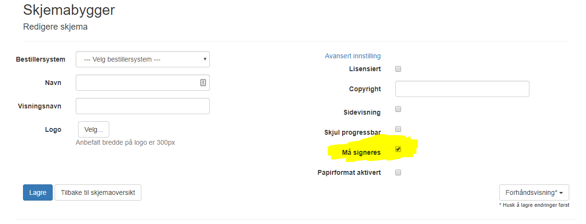

# Integrasjonsguide

*Sist oppdatert 27.08.2019*

### Innholdsfortegnelse

[GENERELT](#generelt)

[BESTILLING AV SKJEMA v2](#bestilling-av-skjema-v2)

[Bestilling klient-side v2](#bestilling-klient-side-v2)

[Bestilling server-side v2](#bestilling-server-side-v2)

[(BESTILLING AV SKJEMA - Utgått)](#bestilling-av-skjema---utgått)

[(Bestilling klient-side - Utgått)](#bestilling-klient-side---utgått)

[(Bestilling server-side - Utgått)](#bestilling-server-side---utgått)

[PASIENTINITIERT BESTILLING AV SKJEMA](#pasientinitiert-bestilling-av-skjema)

[RETUR AV UTFYLT SKJEMA](#retur-av-utfylt-skjema)

[SKJEMA SOM KREVER SIGNATUR](#skjema-som-krever-signatur)

[SENDE MELDING SOM SMS](#sende-melding-som-sms)

[SENDE MELDING SOM EPOST](#sende-melding-som-epost)

[SENDE MELDING TIL INNBYGGER](#sende-melding-til-innbygger)

# GENERELT

## Pasientløsning ePROM
For å se / fylle ut de bestilte skjemaene kan man finne de igjen i pasientløsningen:

[https://proms2.hemit.org/Proms](https://proms2.hemit.org/Proms)

Her finner man alle skjema som er bestilt og man kan f.eks. teste innsending av skjemaer. Pålogging med BankID eller engangskode.


## Testpersoner
ePROM i testmiljøet integrerer med Helsenorge og Digipost sine testmiljøer. For å teste integrasjonen mellom ePROM, Helsenorge og Digipost har vi tilgang til fødselsnummer med BankID. Midlertidig tilgang til disse fås ved henvendelse til Hemit.


## Distribusjonsregler
Vha. parameteren **DistributionRule** kan man bestemme hvordan pasientskjemaet skal distribueres til pasienten. Varslingskanalene er definert i parameteren **NotificationChannel**

Default **DistributionRule** er *Basic* og betyr at ePROM først sjekker om pasienten er tilgjengelig på Helsenorge. Hvis ikke sjekkes det om pasienten har sikker digital postkasse. Hvis **DistributionRule** er satt til *AllowUnsecure* sjekkes det om pasienten er registrert i Difi Kontaktregister med epostadresse eller mobilnummer. Hvis **DistributionRule** er satt til *NoDistribution* sendes det ikke ut varsling til pasienten. Dette kan benyttes hvis Bestillersystemet skal gi engangskode til pasienten. *BasicOrPaper* og *AllowUnsecureOrPaper* er samme som hhv *Basic* og *AllowUnsecure*, men med papir som siste utvei. *PaperOnly*, *HelsenorgeOnly*, *DigitalMailboxOnly* og *UnsecureOnly* sender kun på hhv papir, Helsenorge, sikker digital postkasse og epost/sms.

### DistributionRule
```
0 = Basic
1 = AllowUnsecure
2 = NoDistribution
3 = BasicOrPaper
4 = AllowUnsecureOrPaper
5 = PaperOnly
6 = HelsenorgeOnly
7 = DigitalMailboxOnly
8 = UnsecureOnly
```

### NotificationChannel
```
0 = None
1 = Helsenorge
2 = DigitalMailbox
3 = Unsecure
4 = PhysicalMailbox
```


# BESTILLING AV SKJEMA V2

API-kallet for bestilling av skjema er i v2 endret slik at man får respons med en gang, uten å vente på at bestillingen har gått igjennom til Helsenorge/Digipost. Når bestillingen er fullført (pasienten har fått beskjed og skjemaet ligger klart til utfylling) vil ePROM gjøre et kall mot Bestillersystemet med status for bestillingen. Bestillersystemet må implementere en service som mottar dette kallet.

Bestilling av skjema kan gjøres både fra server-side og fra klient-side. Ved kall fra server-side kan man benytte seg av et API utviklet av Hemit og distribuert som NuGet pakke for å forenkle oppkoblingen.
Alle URL’ene som er oppgitt i dette dokumentet går mot integrasjonsmiljøet for ePROM


## Bestilling klient-side v2

**Eksempelkode (javascript)**
```javascript
function placeFormOrderV2() {
    var url = 'https://proms2.hemit.org/PromsWebApi/api/v2/formorder'; // Demo server
    var apiKey = ""; // The ApiKey for your system
    var formId = "1bc5f9f0-2607-49eb-94f0-6af955bbd79a"; // RAND-12
    var nationalId = "26073941651"; // the national ID of the patient (Norsk fødselsnummer or D-nummer)
    var expiryDate = new Date(new Date().getTime() + (86400000 * 7)); // add 7 days
    var reminderDate = new Date(new Date().getTime() + (86400000 * 6)); // add 6 days
    var metadata = JSON.stringify({ age: 76 });
    var dontStoreCompletedFormInPha = false;
    var distributionRule = "Basic"; 
    var mustBeSigned = false;
    var signingText = null;
    var physicalAddress = null;
    
    $.ajax({
        url: url,
        type: "POST",
        contentType: "application/json;charset=utf-8",
        headers: { "Authorization": "Basic " + apiKey },
        data: JSON.stringify({ formId, nationalId, expiryDate, reminderDate, metadata, dontStoreCompletedFormInPha, distributionRule,  mustBeSigned, signingText, physicalAddress }),
        success: function (data) {
            alert("formOrderId: " + data.id + "\nsingleUseCode: " + data.singleUseCode + "\nloginUrl: " + data.loginUrl + "\npreferred notificationChannel: " + data.notificationChannel);
        },
        error: function () {
            alert("Error!");
        }
    });
}
```

**URL for Web API kall**

[https://proms2.hemit.org/PromsWebApi/api/v2/formorder]

**Parametere - Inn**
* apiKey - ApiKey of the end user system placing the order
* formId - The form to place an order for
* nationalId  - The national id number of the patient the ordered form is addressing (must be either Norsk fødselsnummer or D-nummer)
* expiryDate - The expiry date of the order
* reminderDate - Optional. The date to send a reminder for the order. If not set or NULL, no reminder will be sent
* metadata - Optional. Metadata to send with the order. Pass metadata, like the patient age, as a parameter to this method using an stringified JSON object (ex. JSON.stringify({ age: 76 }))
* dontStoreCompletedFormInPha - Optional. If true, the completed form will not be stored in the patients "Personlig helsearkiv" (Helsenorge) or sent to secure digital mailbox. Default: false
* distributionRule - Optional. The rule used when deciding how to notify the patient ```{ Basic | AllowUnsecure | NoDistribution | BasicOrPaper | AllowUnsecureOrPaper | PaperOnly | HelsenorgeOnly | DigitalMailboxOnly | UnsecureOnly }```. Tallverdien kan sendes. Default: Basic
* mustBeSigned - Optional. Whether the form must be signed
* signingText - Optional. The text displyed for signing
* physicalAddress - Optional. The address to use when sending to physical mailbox. If none is supplied, the address registered in Folkeregisteret is used. PhysicalAddress is a JSON object in the following format:
```
{
    fullName: "Test Testesen",
    addressLine1: "Testeveien 1",
    postalCode: "1234",
    postalPlace: "Testestad"
}
```


**Parametere – Ut**

I tillegg til alle inn-parametre:
* id – The id of this form order
* singleUseCode – A code linked to this form order that the patient can use in combination with his date of birth to log in to PROMS to fill out the ordered form. This parameter only has a value when distributionRule is NoDistribution
* loginUrl – URL the patient can use to log in to PROMS to fill out the ordered form
* notificationChannel – The preferred channel used to notify the patient about the form order ```{ None | Helsenorge | DigitalMailbox | Unsecure | PhysicalMailbox }```. The actual channel used is first known when PROMS performs the callback, notifying about the status.

**Metode**

POST


## Bestilling server-side v2

**API**

Tilgjenglig som NuGet pakke

NuGet repository: https://hemit.myget.org/F/hemitpublic/api/v3/index.json

Navn: Hemit.Proms.Integration

**Eksempelkode (C#)**
```javascript
[HttpPost]
public JsonResult OrderPromsFormV2(Guid formId)
{
    var form = _context.FormService.GetForm(formId);
    var patient = _context.PatientInRegistryService.GetByFormGuid(formId);

    var promsFormId = _formTypeToPromsFormIdMapping[(FormType) form.FormTypeId];

    var result = Api.CreateFormOrderV2(
        ConfigurationManager.AppSettings["PromsApiBaseUrl"],
        ConfigurationManager.AppSettings["PromsApiKey"],
        promsFormId,
        patient.DecryptedPID,
        DateTime.Now.AddDays(7),
        DateTime.Now.AddDays(6),
        GetMetadata(promsFormId, form, patient)
        false,
        DistributionRule.AllowUnsecure,
        false,
        null,
        null);

    if (result.HasErrors)
    {
        Response.StatusCode = result.ErrorStatusCode.Value;
        Response.Write(result.ErrorJson);
        return null;
    }

    _promsFormOrderService.Add(result.FormOrderId, form.Id, form.ReshId);

    return Json(new { 
loginUrl = result.LoginUrl,
singleUseCode = result.SingleUseCode,
notificationChannel = result.NotificationChannel.ToString() });
}
```

**Parametere - Inn**
* promsApiBaseUrl - The base URL of the PROMS API
* apiKey - ApiKey of the end user system placing the order
* formId - The form to place an order for
* nationalId - The national id number of the patient the ordered form is addressing (must be either Norsk fødselsnummer or D-nummer)
* expiryDate - The expiry date of the order
* reminderDate - The date to send a reminder for the order. If NULL, no reminder will be sent
* metadata - Optional. Metadata to send with the order. Pass metadata, like the patient age, as a parameter to this method using an anonymous object (ex. new { age = 23 }).
* dontStoreCompletedFormInPha - Optional. If true, the completed form will not be stored in the patients "Personlig helsearkiv" (Helsenorge) or sent to secure digital mailbox. Default: false
* distributionRule - Optional. The rule used when deciding how to notify the patient ```{ Basic | AllowUnsecure | NoDistribution | BasicOrPaper | AllowUnsecureOrPaper | PaperOnly | HelsenorgeOnly | DigitalMailboxOnly | UnsecureOnly }```. Tallverdien kan sendes. Default: Basic
* mustBeSigned - Optional. Whether the form must be signed
* signingText - Optional. The text displyed for signing
* physicalAddress - Optional. The address to use when sending to physical mailbox. If none is supplied, the address registered in Folkeregisteret is used


promsApiBaseUrl skal være https://proms2.hemit.org/PromsWebApi

**Parametere – Ut**
* CreateFormOrderResult
  * FormOrderId – The id of this form order
  * SingleUseCode – A code linked to this form order that the patient can use in combination with his date of birth to log in to PROMS to fill out the ordered form. This parameter only has a value when distributionRule is NoDistribution
  * LoginUrl – URL the patient can use to log in to PROMS to fill out the ordered form
  * NotificationChannel – The channel used to notify the patient about the form order ```{ None | Helsenorge | DigitalMailbox | Unsecure | PhysicalMailbox }```. The actual channel used is first known when PROMS performs the callback, notifying about the status.


### Feilsituasjoner

Hvis responsen resulterer i "id": "00000000-0000-0000-0000-000000000000" er det ikke generert noe bestilling. Dette skjer hvis fødselsnummeret ikke eksisterer.
Ellers kan følgende feilsituasjoner oppstå:
* BadRequest("The ordered form is not Published")
* BadRequest($"No form with id='{formOrder.formId}' exists")
* BadRequest($"The ordered form needs to be signed. This is not possible when using DistributionRule = 'NoDistribution'.")
* BadRequest($"Form with id='{formOrder.formId}' is not paper enabled")
 

### Mottak av status for bestillingen v2
API-kallet for bestilling av skjema er i v2 endret slik at man får respons med en gang, uten å vente på at bestillingen har gått igjennom til Helsenorge/Digipost. Når bestillingen er fullført (pasienten har fått beskjed og skjemaet ligger klart til utfylling) vil ePROM gjøre et kall mot Bestillersystemet med status for bestillingen. Bestillersystemet må implementere en service som mottar dette kallet.

**URL for Web API kall**
ApiBaseUrl for web API registreres i ePROM Selvbetjeningsmodul under Bestillersystem: [https://proms2.hemit.org/PromsAdministration/](https://proms2.hemit.org/PromsAdministration/)

Web API må være tilgjenglig på URL: https://```<ApiBaseUrl>```/api/PromsFormOrder

F.eks: [https://mrsdev.helsemn.no/PromsTestregisterServices/api/PromsFormOrder/](https://mrsdev.helsemn.no/PromsTestregisterServices/api/PromsFormOrder/)

**Parametere - Inn**
* apiKey – ApiKey of the end user system placing the order
* formOrderId – The Id of the formOrder
* notificationChannel – The actual channel used to notify the patient about the form order ```{ None | Helsenorge | DigitalMailbox | Unsecure | PhysicalMailbox }```.
* formOrderStatus – Status of the formOrder ```{ Ordered | Error }```
  * Ordered – The formOrder was successful
  * Error – The formOrder was not successfull. For time being, the only reason for this is when the patient cannot be notified because there is no way to make contact.

**Parametere - Ut**
* success – true if the request was processed successfully, otherwise false

For parameter inn og ut kan NuGet pakken *Hemit.Proms.Integration* benyttes. Bruk da *Hemit.Proms.Integration.PromsFormOrderRequest* for parameter inn og *Hemit.Proms.Integration.PromsFormOrderResponse* for parameter ut

**Metode**

PUT

Eksempel request fra Proms (JSON)
```
{
    "apiKey" : "",
    "formOrderId" : "184738d0-3c39-e611-9c2a-34e6d72e03c7",
    "notificationChannel" : "Helsenorge",
    "formOrderStatus" : "Ordered"
}
```

# BESTILLING AV SKJEMA - UTGÅTT

Bestilling av skjema kan gjøres både fra server-side og fra klient-side. Ved kall fra server-side kan man benytte seg av et API utviklet av Hemit og distribuert som NuGet pakke for å forenkle oppkoblingen.
Alle URL’ene som er oppgitt i dette dokumentet går mot integrasjonsmiljøet for ePROM


## Bestilling klient-side - UTGÅTT

**Eksempelkode (javascript)**
```javascript
function placeFormOrder() {
    var url = 'https://proms2.hemit.org/PromsWebApi/api/formorder'; // Demo server
    var apiKey = ""; // The ApiKey for your system
    var formId = "1bc5f9f0-2607-49eb-94f0-6af955bbd79a"; // RAND-12
    var nationalId = "26073941651"; // the national ID of the patient (Norsk fødselsnummer or D-nummer)
    var expiryDate = new Date(new Date().getTime() + (86400000 * 7)); // add 7 days
    var reminderDate = new Date(new Date().getTime() + (86400000 * 6)); // add 6 days
    var metadata = JSON.stringify({ age: 76 });
    var dontStoreCompletedFormInPha = false;
    var distributionRule = "Basic"; 
    var physicalAddress = null;
    
    $.ajax({
        url: url,
        type: "POST",
        contentType: "application/json;charset=utf-8",
        headers: { "Authorization": "Basic " + apiKey },
        data: JSON.stringify({ formId, nationalId, expiryDate, reminderDate, metadata, dontStoreCompletedFormInPha, distributionRule, physicalAddress }),
        success: function (data) {
            alert("formOrderId: " + data.id + "\nsingleUseCode: " + data.singleUseCode + "\nloginUrl: " + data.loginUrl + "\npreferred notificationChannel: " + data.notificationChannel);
        },
        error: function () {
            alert("Error!");
        }
    });
}
```

**URL for Web API kall**

[https://proms2.hemit.org/PromsWebApi/api/formorder]

**Parametere - Inn**
* apiKey - ApiKey of the end user system placing the order
* formId - The form to place an order for
* nationalId  - The national id number of the patient the ordered form is addressing (must be either Norsk fødselsnummer or D-nummer)
* expiryDate - The expiry date of the order
* reminderDate - Optional. The date to send a reminder for the order. If not set or NULL, no reminder will be sent
* metadata - Optional. Metadata to send with the order. Pass metadata, like the patient age, as a parameter to this method using an stringified JSON object (ex. JSON.stringify({ age: 76 }))
* dontStoreCompletedFormInPha - Optional. If true, the completed form will not be stored in the patients "Personlig helsearkiv" (Helsenorge) or sent to secure digital mailbox. Default: false
* distributionRule - Optional. The rule used when deciding how to notify the patient ```{ Basic | AllowUnsecure | NoDistribution | BasicOrPaper | AllowUnsecureOrPaper | PaperOnly | HelsenorgeOnly | DigitalMailboxOnly | UnsecureOnly }```. Tallverdien kan sendes. Default: Basic
* physicalAddress - Optional. The address to use when sending to physical mailbox. If none is supplied, the address registered in Folkeregisteret is used. PhysicalAddress is a JSON object in the following format:
```
{
    fullName: "Test Testesen",
    addressLine1: "Testeveien 1",
    postalCode: "1234",
    postalPlace: "Testestad"
}
```

**Parametere – Ut**

I tillegg til alle inn-parametre:
* id – The id of this form order
* singleUseCode – A code linked to this form order that the patient can use in combination with his date of birth to log in to PROMS to fill out the ordered form. This parameter only has a value when distributionRule is NoDistribution
* loginUrl – URL the patient can use to log in to PROMS to fill out the ordered form
* notificationChannel – The preferred channel used to notify the patient about the form order ```{ None | Helsenorge | DigitalMailbox | Unsecure | PhysicalMailbox }```. The actual channel used is first known when PROMS performs the callback, notifying about the status.

**Metode**

POST


## Bestilling server-side - UTGÅTT

**API**

Tilgjenglig som NuGet pakke

NuGet repository: https://hemit.myget.org/F/hemitpublic/api/v3/index.json

Navn: Hemit.Proms.Integration

**Eksempelkode (C#)**
```javascript
[HttpPost]
public JsonResult OrderPromsForm(Guid formId)
{
    var form = _context.FormService.GetForm(formId);
    var patient = _context.PatientInRegistryService.GetByFormGuid(formId);

    var promsFormId = _formTypeToPromsFormIdMapping[(FormType) form.FormTypeId];

    var result = Api.CreateFormOrderV2(
        ConfigurationManager.AppSettings["PromsApiBaseUrl"],
        ConfigurationManager.AppSettings["PromsApiKey"],
        promsFormId,
        patient.DecryptedPID,
        DateTime.Now.AddDays(7),
        DateTime.Now.AddDays(6),
        GetMetadata(promsFormId, form, patient)
        false,
        DistributionRule.AllowUnsecure);

    if (result.HasErrors)
    {
        Response.StatusCode = result.ErrorStatusCode.Value;
        Response.Write(result.ErrorJson);
        return null;
    }

    _promsFormOrderService.Add(result.FormOrderId, form.Id, form.ReshId);

    return Json(new { 
loginUrl = result.LoginUrl,
singleUseCode = result.SingleUseCode,
notificationChannel = result.NotificationChannel.ToString() });
}
```

**Parametere - Inn**
* promsApiBaseUrl - The base URL of the PROMS API
* apiKey - ApiKey of the end user system placing the order
* formId - The form to place an order for
* nationalId - The national id number of the patient the ordered form is addressing (must be either Norsk fødselsnummer or D-nummer)
* expiryDate - The expiry date of the order
* reminderDate - The date to send a reminder for the order. If NULL, no reminder will be sent
* metadata - Optional. Metadata to send with the order. Pass metadata, like the patient age, as a parameter to this method using an anonymous object (ex. new { age = 23 }).
* dontStoreCompletedFormInPha - Optional. If true, the completed form will not be stored in the patients "Personlig helsearkiv" (Helsenorge) or sent to secure digital mailbox. Default: false
* distributionRule - Optional. The rule used when deciding how to notify the patient ```{ Basic | AllowUnsecure | NoDistribution | BasicOrPaper | AllowUnsecureOrPaper | PaperOnly }```. Tallverdien kan sendes. Default: Basic


promsApiBaseUrl skal være https://proms2.hemit.org/PromsWebApi

**Parametere – Ut**
* CreateFormOrderResult
  * FormOrderId – The id of this form order
  * SingleUseCode – A code linked to this form order that the patient can use in combination with his date of birth to log in to PROMS to fill out the ordered form. This parameter only has a value when distributionRule is NoDistribution
  * LoginUrl – URL the patient can use to log in to PROMS to fill out the ordered form
  * NotificationChannel – The channel used to notify the patient about the form order ```{ None | Helsenorge | DigitalMailbox | Unsecure | PhysicalMailbox }```. The actual channel used is first known when PROMS performs the callback, notifying about the status.


### Feilsituasjoner

Hvis responsen resulterer i "id": "00000000-0000-0000-0000-000000000000" er det ikke generert noe bestilling. Dette skjer hvis fødselsnummeret ikke eksisterer.
Ellers kan følgende feilsituasjoner oppstå:
* BadRequest("The ordered form is not Published")
* BadRequest($"No form with id='{formOrder.formId}' exists")
* BadRequest($"The ordered form needs to be signed. This is not possible when using DistributionRule = 'NoDistribution'.")
* BadRequest($"Form with id='{formOrder.formId}' is not paper enabled")
 

### Mottak av status for bestillingen
API-kallet for bestilling av skjema er i v2 endret slik at man får respons med en gang, uten å vente på at bestillingen har gått igjennom til Helsenorge/Digipost. Når bestillingen er fullført (pasienten har fått beskjed og skjemaet ligger klart til utfylling) vil ePROM gjøre et kall mot Bestillersystemet med status for bestillingen. Bestillersystemet må implementere en service som mottar dette kallet.

**URL for Web API kall**
ApiBaseUrl for web API registreres i ePROM Selvbetjeningsmodul under Bestillersystem: [https://proms2.hemit.org/PromsAdministration/](https://proms2.hemit.org/PromsAdministration/)

Web API må være tilgjenglig på URL: https://```<ApiBaseUrl>```/api/PromsFormOrder

F.eks: [https://mrsdev.helsemn.no/PromsTestregisterServices/api/PromsFormOrder/](https://mrsdev.helsemn.no/PromsTestregisterServices/api/PromsFormOrder/)

**Parametere - Inn**
* apiKey – ApiKey of the end user system placing the order
* formOrderId – The Id of the formOrder
* formOrderStatus – Status of the formOrder ```{ Ordered | Error }```
  * Ordered – The formOrder was successful
  * Error – The formOrder was not successfull. For time being, the only reason for this is when the patient cannot be notified because there is no way to make contact.

**Parametere - Ut**
* success – true if the request was processed successfully, otherwise false

For parameter inn og ut kan NuGet pakken *Hemit.Proms.Integration* benyttes. Bruk da *Hemit.Proms.Integration.PromsFormOrderRequest* for parameter inn og *Hemit.Proms.Integration.PromsFormOrderResponse* for parameter ut

**Metode**

PUT

Eksempel request fra Proms (JSON)
```
{
    "apiKey" : "",
    "formOrderId" : "184738d0-3c39-e611-9c2a-34e6d72e03c7",
    "formOrderStatus" : "Ordered"
}
```

# PASIENTINITIERT BESTILLING AV SKJEMA

Pasientinitert bestilling av skjema er en mulighet hvor pasienten kan gå via en direktelink for utfylling av et skjema. Identifisering skjer ved at pasienten logger på med BankId.

For at et skjema skal kunne bestilles av pasienten må "Kan bestilles av pasient" (under "Avansert innstilling" i skjemabygger) være huket av, samt at skjemaet må være publisert

URL for pasientbestilling av skjema blir tilgjengelig etter man har lagret skjemaet ("Offentlig url" under "Avansert innstilling")

Det er også mulig å velge om man ønsker at skjema bestilt av pasient må signeres: Huk av "Skjema bestilt av pasient må signeres" under "Avansert innstilling". Forutsetter at "Signering støttes" (under "Avansert innstilling")  er valgt først.

Ved retur av utfyllt skjema sendes pasientens personnummer og skjemaets ID sammen med skjemadataene. I tillegg får isPatientInitiated verdien 'true':
```
{
    "...": "...",
    "isPatientInitiated": true,
    "patientInitiatedValues":
    {
        "formId": "1bc5f9f0-2607-49eb-94f0-6af955bbd79a",
        "nationalId": "26073941651"
    }
}
```

# RETUR AV UTFYLT SKJEMA

Når pasienten har fylt ut et skjema sendes skjemaet tilbake til Bestillersystemet.

Bestillersystemet må implementere en service som mottar skjemadataene.

### Mottak

**URL for Web API kall**
ApiBaseUrl for web API registreres i ePROM Selvbetjeningsmodul under Bestillersystem: [https://proms2.hemit.org/PromsAdministration/](https://proms2.hemit.org/PromsAdministration/)

Web API må være tilgjenglig på URL: https://```<ApiBaseUrl>```/api/PromsFormOrder

F.eks: [https://mrsdev.helsemn.no/PromsTestregisterServices/api/PromsFormOrder](https://mrsdev.helsemn.no/PromsTestregisterServices/api/PromsFormOrder)

**Parametere - Inn**
* apiKey – ApiKey of the end user system placing the order
* formOrderId – The Id of the formOrder
* formData - The form data of returned form
* formOrderStatus – Status of the returned formOrder ```{ Completed | Expired }```
* signedFormId – The Id of the signed form if form has been signed
* timestamp – Date and time when the form was submitted
* scannedPaperId – The Id of the scanned paper form if form distributed as paper
* formDataWarnings – A list for form data of returned form with validate warnings
* notificationChannel - The channel used to notify the patient about the form order ```{ None | Helsenorge | DigitalMailbox | Unsecure | PhysicalMailbox }```
* isPatientInitiated -  If the order is initiated by a patient
* patientInitiatedValues - Information about the patient initiated order
  * formId - The Id of the form ordered
  * nationalId - The national id number of the patient ordered the form

**Parametere - Ut**
* success – true if the request was processed successfully, otherwise false

For parameter inn og ut kan NuGet pakken *Hemit.Proms.Integration* benyttes. Bruk da *Hemit.Proms.Integration.PromsFormOrderRequest* for parameter inn og *Hemit.Proms.Integration.PromsFormOrderResponse* for parameter ut

**Metode**

PUT

Eksempel request fra Proms (JSON)
NB! formData sendes som stringified JSON-object
```
{
    "apiKey" : "",
    "formOrderId" : "184738d0-3c39-e611-9c2a-34e6d72e03c7",
    "formData" : '{"HealthGeneral":1,"HealthLimitingActivities":1,"HealthLimitingFloors":1,"PhysicalHealthLessDone":1,"PhysicalHealthLimitingActivity":1,"EmotionalIssuesLessDone":1,"EmotionalIssuesLimitingActivity":1,"LastFourWeeksPain":2,"LastFourWeeksRelaxed":2,"LastFourWeeksSurplusOfEnergy":2,"LastFourWeeksDepressed":2,"LastFourWeeksSocial":1}',
    "formOrderStatus" : "Completed",
    "signedFormId":"00000000-0000-0000-0000-000000000000",
    "timestamp":"2019-05-03T00:00:00+02:00",
    "scannedPaperId":"00000000-0000-0000-0000-000000000000",
    "formDataWarnings":[{"fieldName":"Key","warning":"Value"},{"fieldName":"Key2","warning":"Value2"}]
}
```


# SKJEMA SOM KREVER SIGNATUR

## Bestilling ##
Skjema som krever signatur bestilles av Bestillersystem på vanlig måte (se [BESTILLING AV SKJEMA](#bestilling-av-skjema)). For å angi at et skjema krever signatur må det hukes av for dette i skjemadesigneren (under *Avansert innstilling*) i ePROM Selvbetjeningsmodul: [https://proms2.hemit.org/PromsAdministration/](https://proms2.hemit.org/PromsAdministration/):



*NB! Skjema som krever signatur kan ikke bestilles med engangskode. Pasienten **må** logge inn med BankId ved utfylling.*

## Utfylling ##
Skjema som krever signatur fylles ut på samme måte som andre skjema av pasienten. Ved levering trykker pasienten på knappen *Signér og levere* i stedet for *Levere* som for andre skjema. Pasienten blir da tatt gjennom signeringsstegene før skjemaet blir levert.


## Mottak ##
Skjema som krever signatur leveres tilbake til Bestillersystem på vanlig måte (se [RETUR AV UTFYLT SKJEMA](#retur-av-utfylt-skjema)), men med en ekstra parameter *signedFormId*. Dette er en id som kan brukes av Bestillersystem for å laste ned det signerte dokumentet. Det signerte dokumentet er en PDF-fil av det utfyllte skjemaet samt en elektronisk signatur.

*NB! Bestillersystem er ansvarlig for at det signerte dokumentet blir lastet ned og at det blir oppbevart på en sikker måte. Det signerte dokumentet vil være tilgjengelig for nedlasting gjennom ePROM i minimum 30 dager.*

### Nedlasting av det signerte dokumentet ###
GET request mot: ```<PromsApiBaseUrl>```/ExternalDocument/```<SignedFormId>```

```<PromsApiBaseUrl>``` skal være *https://proms2.hemit.org/PromsWebApi*

**Send med ApiKey i request headeren**
```
Header name: authorization
Header value: Basic <ApiKey>
```

# SENDE MELDING SOM SMS

Hvis man har behov for å sende korte beskjeder til pasienten kan man sende dette som SMS via ePROM.

**Det er viktig at dette er ikke-sensitiv informasjon.**

Alle URL’ene som er oppgitt i dette dokumentet går mot integrasjonsmiljøet for ePROM

### Sende melding klient-side

**Eksempelkode (javascript)**
```javascript
function sendUnsecureMessageSms() {
    var url = 'https://proms2.hemit.org/PromsWebApi/api/unsecuremessagesms'; // Demo server
    var apiKey = ""; // The ApiKey for your system
    var smsText = " En ikkeSensitivMelding som ikke er sensitiv "; // Message
    var nationalId = "26073941651"; // the national ID of the patient (Norsk fødselsnummer or D-nummer)
    var phoneNumber = ""; // The mobile number if provided

    $.ajax({
        url: url,
        type: "POST",
        contentType: "application/json;charset=utf-8",
        data: JSON.stringify({ apiKey, smsText, nationalId, phoneNumber }),
        success: function (data) {
            alert("success: " + data.Success);
        },
        error: function () {
            alert("Error!");
        }
    });
}
```

**URL for Web API kall**

[https://proms2.hemit.org/PromsWebApi/api/unsecuremessagesms](https://proms2.hemit.org/PromsWebApi/api/unsecuremessagesms)

**Parametere - Inn**
* apiKey - ApiKey of the end user system placing the order
* smsText – Nonsensitive message to be sent
* nationalId  - The national id number of the patient the ordered form is addressing (must be either Norsk fødselsnummer or D-nummer)
* phoneNumber - Optional. The mobile number if provided
One of the parameters nationalId or phoneNumber must be provided.


**Parametere – Ut**
* success – true or false, whether sending message was ok

**Metode**

POST


### Sende melding server-side

**API**

Tilgjenglig som NuGet pakke

NuGet repository: [https://hemit.myget.org/F/hemitpublic/api/v3/index.json](https://hemit.myget.org/F/hemitpublic/api/v3/index.json)

Navn: Hemit.Proms.Integration

**Eksempelkode (C#)**
```
[HttpPost]
public JsonResult SendUnsecureMessageSms(string nationalId)
{
    var promsApiBaseUrl = ConfigurationManager.AppSettings["PromsApiBaseUrl"];
    var smsText = "En ikkeSensitivMelding som ikke er sensitiv";
    var apiKey = ConfigurationManager.AppSettings["PromsApiKey"];
    var response = Api.SendUnsecureMessageSms(promsApiBaseUrl, apiKey, smsText, nationalId);
    if (result.HasErrors)
    {
        Response.StatusCode = result.ErrorStatusCode.Value;
        Response.Write(result.ErrorJson);
        return null;
    }

    return Json(new {success = response.Success});
}
```

**Parametere - Inn**
* apiKey - ApiKey of the end user system placing the order
* smsText – Nonsensitive message to be sent
* nationalId  - The national id number of the patient the ordered form is addressing (must be either Norsk fødselsnummer or D-nummer)
* phoneNumber - Optional. The mobile number if provided
* One of the parameters nationalId or phoneNumber must be provided.

promsApiBaseUrl skal være https://proms2.hemit.org/PromsWebApi

**Parametere – Ut**
* SendUnsecureMessageSmsResult
  * success – true og false, whether sending message was ok
 
### Feilsituasjoner

**Følgende feilsituasjoner kan oppstå:**
* BadRequest($"apiKey '{message.apiKey}' doesn't exists")
* BadRequest("Either nationalId or phoneNumber must be specified")


# SENDE MELDING SOM EPOST

Hvis man har behov for å sende informasjon til pasienten kan man sende dette som Epost via PROMs. 

**Det er viktig at dette er ikke-sensitiv informasjon.**

Bestilling av skjema kan gjøres både fra server-side og fra klient-side. Ved kall fra server-side kan man benytte seg av et API utviklet av Hemit og distribuert som NuGet pakke for å forenkle oppkoblingen.

Alle URL’ene som er oppgitt i dette dokumentet går mot integrasjonsmiljøet for ePROM

 
### Sende melding klient-side

Eksempelkode (javascript)
```javascript
function sendUnsecureMessageEmail() {
    var url = 'https://proms2.hemit.org/PromsWebApi/api/unsecuremessageemail'; // Demo server
    var apiKey = ""; // The ApiKey for your system
    var emailTitle = " En ikkeSensitivTittel som ikke er sensitiv "; // Subject
    var emailText = " En ikkeSensitivMelding som ikke er sensitiv "; // Message
    var nationalId = "26073941651"; // the national ID of the patient (Norsk fødselsnummer or D-nummer)
    var emailAddress = ""; // The email address if provided

    $.ajax({
        url: url,
        type: "POST",
        contentType: "application/json;charset=utf-8",
        data: JSON.stringify({ apiKey, emailTitle, emailText, nationalId, emailAddress }),
        success: function (data) {
            alert("success: " + data.Success);
        },
        error: function () {
            alert("Error!");
        }
    });
}
```

**URL for Web API kall**

[https://proms2.hemit.org/PromsWebApi/api/unsecuremessageemail](https://proms2.hemit.org/PromsWebApi/api/unsecuremessageemail)

**Parametere - Inn**
* apiKey - ApiKey of the end user system placing the order
* emailTitle – Nonsensitive subject of email
* emailText – Nonsensitive message to be sent
* nationalId  - The national id number of the patient the ordered form is addressing (must be either Norsk fødselsnummer or D-nummer)
* emailAddress - Optional. The email address if provided
One of the parameters nationalId or emailAddress must be provided.


**Parametere – Ut**
* success – true or false, whether sending message was ok

**Metode**

POST

 
### Sende melding server-side

**API**

Tilgjenglig som NuGet pakke

NuGet repository: [https://hemit.myget.org/F/hemitpublic/api/v3/index.json](https://hemit.myget.org/F/hemitpublic/api/v3/index.json)

Navn: Hemit.Proms.Integration

Eksempelkode (C#)
```
[HttpPost]
public JsonResult SendUnsecureMessageEmail(string nationalId)
{
    var promsApiBaseUrl = ConfigurationManager.AppSettings["PromsApiBaseUrl"];
    var emailTitle = "En ikkeSensitivTittel som ikke er sensitiv";
    var emailText = "En ikkeSensitivMelding som ikke er sensitiv";
    var emailAddress = "";
    var apiKey = ConfigurationManager.AppSettings["PromsApiKey"];
    var response = Api.SendUnsecureMessageEmail(promsApiBaseUrl, apiKey, emailTitle, emailText, nationalId, emailAddress);
    if (result.HasErrors)
    {
        Response.StatusCode = result.ErrorStatusCode.Value;
        Response.Write(result.ErrorJson);
        return null;
    }

    return Json(new {success = response.success});
}
```

**Parametere - Inn**
* apiKey - ApiKey of the end user system placing the order
* emailTitle – Nonsensitive title of the message to be sent
* emailText – Nonsensitive message to be sent
* nationalId  - The national id number of the patient the ordered form is addressing (must be either Norsk fødselsnummer or D-nummer)
* emailAddress - Optional. The email address if provided

One of the parameters nationalId or emailAddress must be provided.

promsApiBaseUrl skal være https://proms2.hemit.org/PromsWebApi

**Parametere – Ut**
* SendUnsecureMessageEmailResult
 * success – true og false, whether sending message was ok

### Feilsituasjoner

Følgende feilsituasjoner kan oppstå:
* BadRequest($"apiKey '{message.apiKey}' doesn't exists")
* BadRequest("Either nationalId or emailAddress must be specified")


# SENDE MELDING TIL INNBYGGER

Hvis man har behov for å sende sensitiv informasjon til pasienten kan man sende dette via ePROM.

Utsending av melding kan gjøres både fra server-side og fra klient-side. Ved kall fra server-side kan man benytte seg av et API utviklet av Hemit og distribuert som NuGet pakke for å forenkle oppkoblingen.

Alle URL’ene som er oppgitt i dette dokumentet går mot integrasjonsmiljøet for ePROM


### Sende melding klient-side

**URL for Web API kall**
[https://proms2.hemit.org/PromsWebApi/api/messagetocitizen](https://proms2.hemit.org/PromsWebApi/api/messagetocitizen)

**Parametere – Inn**
* apiKey - ApiKey of the end user system placing the order
* formId - The form to place an order for
* nationalId  - The national id number of the patient the ordered form is addressing (must be either Norsk fødselsnummer or D-nummer)
* senderInfo - Information about the sender
* messageInfo - Information about the message
* documentCollection – Collection of documents to send to citizen
* notificationChannel - The channel used to notify the patient about the form order ```{ None | Helsenorge | DigitalMailbox | Unsecure }``` Tallverdien kan sendes.

**Parametere – Ut**
* notificationChannel – The channel used to notify the patient about the form order ```{ None | Helsenorge | DigitalMailbox | Unsecure }```

**Metode**

POST


### Sende melding server-side

**API**
Tilgjenglig som NuGet pakke

NuGet repository: [https://hemit.myget.org/F/hemitpublic/api/v3/index.json](https://hemit.myget.org/F/hemitpublic/api/v3/index.json)

Navn: Hemit.Proms.Integration

Eksempelkode (C#)
```
[HttpPost]
public JsonResult SendMessageToCitizen(string nationalId, DocumentCollection documentCollection)
{
// <add key="PromsApiBaseUrl" value="http://mrsdev.helsemn.no/PromsWebApi/" />
var promsApiBaseUrl = ConfigurationManager.AppSettings["PromsApiBaseUrl"];
var apikey = ConfigurationManager.AppSettings["ApiKey"];
var messageInfo = new MessageInfo {
    title = "Ikkesensitiv tittel på melding",
    description = "Beskrivelse av melding",
    merknad = "Helseundersøkelsene i Nord Trøndelag - HUNT"
};
var senderInfo = new SenderInfo {
    organisationName = "Navn på organisasjon",
    organisationNr = "Organisasjon nr"
};
var notificationPriorityList = new List<NotificationChannel>
{
    NotificationChannel.Helsenorge,
    NotificationChannel.DigitalMailbox
};
    var result = Api.SendMessageToCitizen(
promsApiBaseUrl, 
apikey, 
nationalId, 
senderInfo, 
messageInfo, 
documentCollection, 
notificationPriorityList);

    if (result.HasErrors)
    {
        Response.StatusCode = result.ErrorStatusCode.Value;
        Response.Write(result.ErrorJson);
        return null;
    }

    return Json(new { 
notificationChannel = result.NotificationChannel });
}
```

**Parametere - Inn**
* promsApiBaseUrl - The base URL of the PROMS API
* apiKey - ApiKey of the end user system placing the order
* nationalId - The national id number of the patient the ordered form is addressing (must be either Norsk fødselsnummer or D-nummer)
* senderInfo - Information about the sender
* messageInfo - Information about the message
* documentCollection – Collection of documents to send to citizen
* notificationChannel - The channel used to notify the patient about the form order ```{ None | Helsenorge | DigitalMailbox | Unsecure }``` Tallverdien kan sendes.


promsApiBaseUrl skal være https://proms2.hemit.org/PromsWebApi

**Parametere – Ut**
* SendMessageToCitizenResult
 * notificationChannel – The channel used to notify the patient about the form order ```{ None | Helsenorge | DigitalMailbox | Unsecure }```


### Feilsituasjoner

Hvis responsen resulterer i ```"notificationChannel": "0"``` er det ikke sendt noe melding til innbygger. Dette skjer hvis ePROM ikke kan nå innbygger via helsenorge, digipost. Dette er også tilfelle hvis fødselsnummeret ikke eksisterer.

Ellers kan følgende feilsituasjoner oppstå:
* 504 GatewayTimeout, "Timeout while waiting for response from Helsenorge"
* 502 BadGateway, "Unable to communicate with Helsenorge. No message sent."
* 400 BadRequest("Main document in MessageToCitizen is missing")
* 400 BadRequest($"apiKey '{formOrder.apiKey}' doesn't exists")
* 400 BadRequest($"No form with id='{formOrder.formId}' exists")

