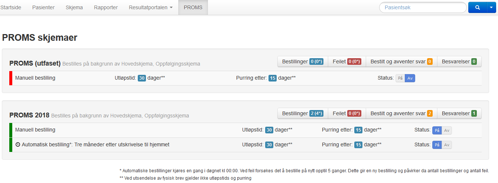
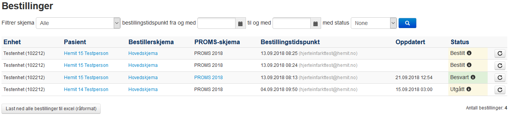

### PROMS Admin i MRS
Registeransvarlig har tilgang til et Admingrensesnitt for PROMs i MRS.

Her kan man sette hvilke PROMS-skjema som skal være aktive for utsending og samtidig sette utløpstid og purretid som skal være gjeldende for registeret. Default er 30 dagers utlåpstid og 15 dagers purretid.

Lista med PROMS-bestillinger kan filtreres på skjema, tidspunkt og status. Lista viser diverse informasjon om bestillingene, f.eks. bestillingstidspunkt og tidspunkt for når bestillingen er besvart eller utgått. Status kan være **Bestilt**, **Besvart**, **Utgått** eller **Feilet**. I-ikonet viser hvilken kanal varslingen er sendt til mottaker.

### Datadump av PROMS bestillinger
PROMS-bestillingene er tilgjengelig for nedlasting til Excel (datadump) ved å klikke på knappen *Last ned alle bestillinger til excel (råformat)*. Datadumpen inneholder følgende:

* **Id** =  GUID til bestillingerskjema
* **TargetFormId** =  GUID til registerskjemaet bestillingen er koblet til
* **TargetFormTypeId** =  1 er hovedskjema, 2 er oppfølgingsskjema
* **CreatedFormId** = GUID på pasientskjemaet når det er besvart av pasient
* **Code** = engangskode generert for pålogging
* **UniqueId** = internt ID for å forhindre dobbeltbestillinger, trenger ikke tenke på denne

### OrderStatus:
Statuskoder for en bestilling:
* 0 = bestilt
* 1 = besvart
* 2 = utgått
* 3 = feilet

### ErrorCode:
Feilkoder som kan oppstå ved en bestillingen:
* 0 = ingen feil
* 1 = ukjent feil (bør ikke skje)
* 2 = tidligere  bestilt
* 3 = Person er ikke digitalt aktiv eller har ikke sikker digital postkasse
* 4 = Ekstern feil (bør ikke skje)
* 5 = Intern feil (bør ikke skje)
* 6 = pasient er død
* 7 = Feil fra PROMS server (bør ikke skje)

### NotificationChannel
Mottaker er varslet via en av følgende kanaler:
* 0 = pasient har ikke fått beskjed, det vil si engangskode eller feilet bestilling
* 1 = helsenorge
* 2 = digital postkasse
* 3 = usikker kanal, epost eller sms
* 4 = fysisk brev

### DistributionRule:
Pasientskjemaet er distribuert med en av følgende regler:
* 0 = *default* - varsling via sikker kanal, helsenorge eller digital postkasse
* 1 = varsling via usikker kanal, epost eller sms, eller *default*
* 2 = varsling sendes ikke, engangskode må ev. leveres manuelt
* 3 = skjema som fysisk brev, eller *default*
* 4 = varsling via usikker kanal, skjema som fysisk brev, eller *default*
* 5 = skjema som fysisk brev
