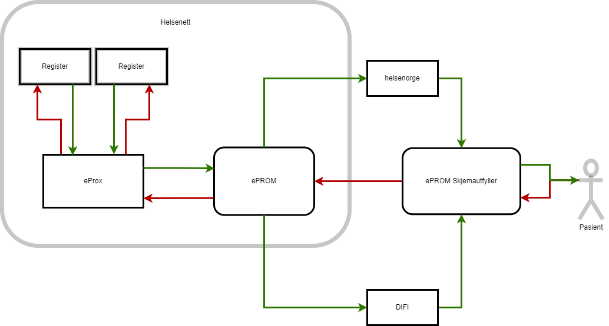
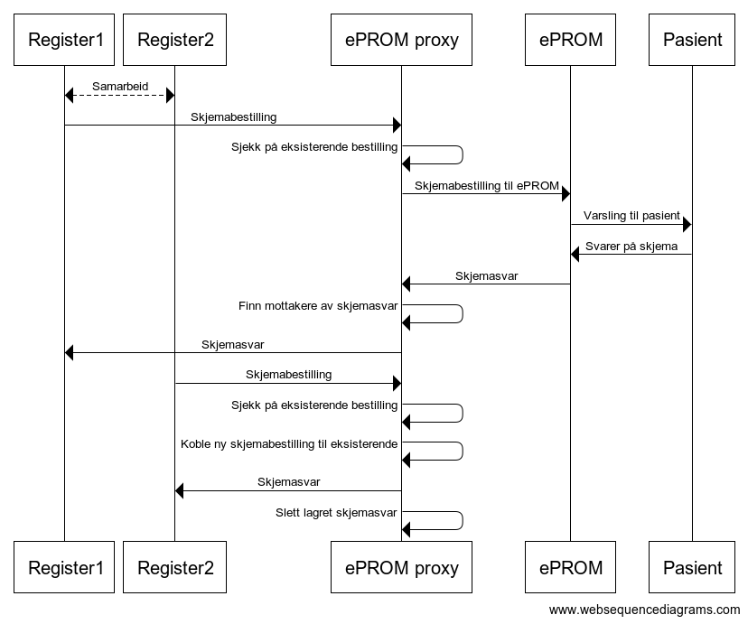

# ePROM proxy - ePROX

ePROM proxy - ePROX - gir muligheten for to eller flere bestillersystem til å samarbeide om bestilling av pasientskjema og mottak av av besvarte pasientskjema. 

Bakgrunnen for ePROX at det finnes flere registre med overlappende pasientgrupper. Det har ikke være mulig å koordinere utsending av pasientskjema på tvers av registre, og det har ført til at pasienter får henvendelser flere ganger om samme hendelse/sykdomsforløp, eller at noen registre får lavere dekningsgrad enn nødvendig. ePROX vil gjøre det mulig for et register å koble seg på et annet registers bestilling, forutsatt at begge registre er registrert i ePROX.

- Registrene kommuniserer utelukkende med ePROX
- ePROX er registrert som et helt vanlig bestillersystem i ePROM, og kommuniserer med ePROM via samme API som alle andre bestillersystemer.
- Skjema som er delt mellom registrene ligger i ePROM under ePROX bestillersystem sin skjemakatalog

## Overordnet flytdiagram

Flytdiagrammet under viser hva som skjer når to registre bestiller samme skjema via ePROX. I dette tilfellet bestiller begge registre skjemaet før pasienten svarer. Begge registre kobles da til samme bestilling mot ePROM, og mottar svaret samtidig når/hvis pasienten velger å svare.  

Flytdiagrammet under viser hva som skjer når to registre bestiller samme skjema via ePROX. I dette tilfellet bestiller register nr 2 skjemaet etter at pasienten har svart på bestillingen fra register 1. Register 2 vil da motta svaret umiddelbart. 

[ePROX i bruk](IntegrasjonOgBrukEProx)

[Tilbake](./)
