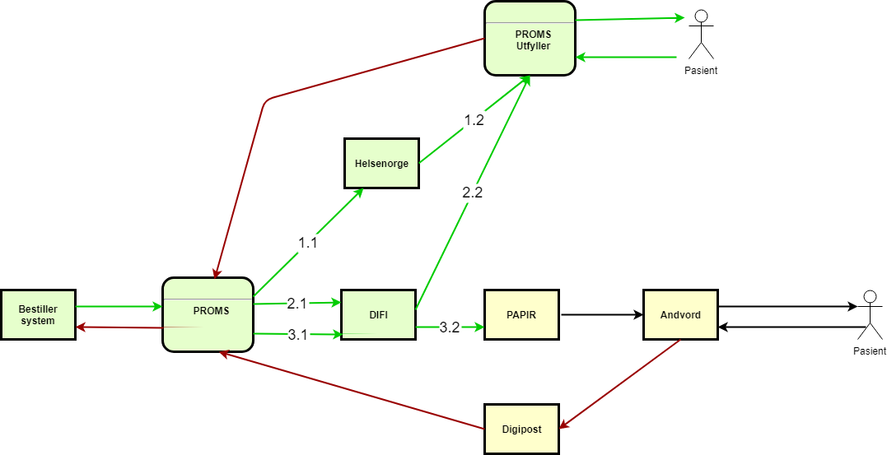

## Overordnet skisse for ePROM papir (PIPP)

Standard ePROM-skjemaflyt baserer seg på digitale kanaler (helsenorge, digital postboks, engangskode, usikker kanal). I noen tilfeller kan det være nyttig å nå pasienter som ikke er digitalt aktive. ePROM kan da utvides med papirflyt i tillegg til de digitale kanalene. Skissen under viser papirflyt på et overordnet nivå:

