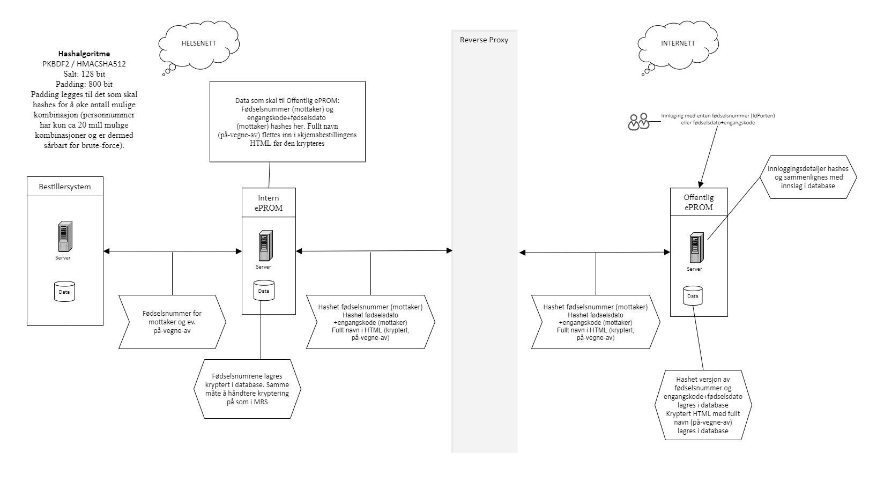

## Flyt og sikkerhet ved bruk av "på vegne av"

Standard skjemaflyt baserer seg på at pasienten selv fyller ut skjema. I noen tilfeller er det ønskelig at noen fyller ut skjema på vegne av pasienten. Det kan dreie seg om en foresatt, verge, behandler, pårørende etc. Skissen under viser flyten og hvordan sikkerheten ivaretas ved bruk av ePROM "på vegne av"-funksjonalitet.  
**NB!** "På vegne av" funksjonalitet er ikke aktiv mot helsenorge.

## "På vegne av"-funksjonalitet og personvern
For at mottaker av bestillingen skal kunne vite hvem skjemaet besvares på vegne av vises som default en informasjonstekst, både i notifikasjonen som sendes og i selve skjemaet, som viser fullt navn til den som skjemaet besvares på vegne av. Det er derfor **svært viktig** å sikre at selve bestillingen går til rett fødselsnummer slik at sensitive opplysninger ikke havner på avveie. Dette er bestillersystemet sitt ansvar å sikre, ePROM gjør ingen validering av relasjon mellom fødselsnummer til mottaker og den skjemaet besvares på vegne av.

Det er mulig å endre informasjonsteksten om "på vegne av" slik at den ikke angir den som skjemaet besvares på vegne av. Dette gjøres ved å overstyre default "På vegne av info" i PROMs selvbetjeningsmodul -> Skjemainformasjon. Eksempel på slik anonym tekst kan være: "Skjemaet skal fylles ut sammen med pasienten.". Det er da viktig å tenke på at mottaker ikke nødvendigvis kan forstå nøyaktig hvem skjemaet faktisk gjelder.

[Tilbake](./)
