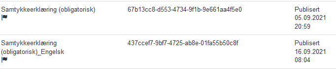
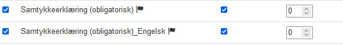
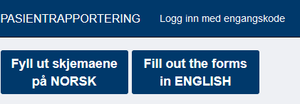

# FLERSPRÅKLIGHET I PASIENTSKJEMA

*Sist oppdatert 16.09.2021*

## Hvilke språk støttes
- norsk
- engelsk 

## Oppretting av skjema

Først opprettes et skjema på norsk. Deretter lager man en kopi av dette skjema, vha "Lag-kopi"-funksjonen, og oversetter all tekst, inkludert hjelpetekst til engelsk.
NB: Det er viktig av alle variablene (feltnavn) i skjemaene er like i de to versjonene.

Navnet på skjemaene kan med fordel inneholder hvilket språk skjemet er på. F.eks. 
- Samtykkeerklæring (obligatorisk)
- Samtykkeerklæring (obligatorisk)_Engelsk

Visningsnavnet oversettes på skjemaets språk
- Samtykkeerklæring (obligatorisk)
- Consent form

Når dette er på plass gir man beskjed til eprom@hemit.no slik at Admin i ePROM kan sette riktig spåkkode på skjemaene, no for norsk og en for engelsk. Skjemaene vil vises med et flaggikon i Skjemakatalogen: 

I tillegg oppretter Admin et Samleskjema med aktuelle språkkoder, no og en.

Deretter kan man i dette Samleskjemaet legge inn ønskede skjema. 
Man må krysse av for både den norske og den engelske versjonen og sette like verdier på rekkefølge og ev om skjemaet er obligatorisk.

## Utfylling av pasientskjemaet

Når bruker mottar et slik skjema får man valget mellom NORSK og ENGELSK.

Når det valget er gjort vises skjemaene på det valgte språket.

Ved eventuell mellomlagring i helsenorge vil språkvalget lagres og man slipper å velge på nytt når man åpner skjemet igjen.
