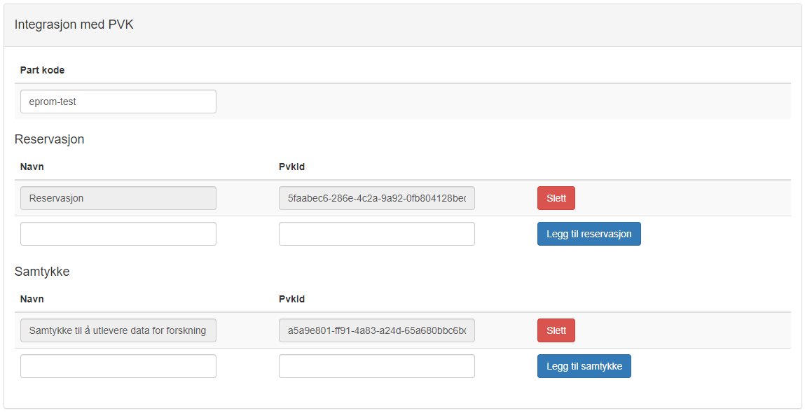

# Samtykke

I dag er det slik at aktivt, informert (skriftlig eller digitalt) samtykke er det som kreves for å inkludere en pasient i de fleste kvalitetsregistrene i Norge. Det er en utfordring f.eks. ved akutt sykdom, her kan det være mer hensiktmessig å benytte seg av reservasjon. Med samtykke ligger intitiativet hos registeret som ønsker å inkludere pasienten.

# Reservasjon

Reservasjon er noe pasienten kan ta stilling til på generelt grunnlag, og er ikke knyttet til en spesfikk hendelse (innleggelse/inngrep/skade etc). Med reservasjonsrett ligger initiativet hos pasienten eller pasientens familie, når det gjelder muligheten til å slettes eller ikke inkluderes.

# Samtykke og reservasjon på helsenorge

I tillegg til å gi samtykke eller reservere seg vha et papirskjema som sendes til registeret, er det mulig å legge til rette for at pasienten kan gjøre dette selv, digitalt via helsenorge.

Informasjon om samtykker og reservasjoner finner pasienten under personverninnstillinger (Profil og innstillinger/Personverninnstillinger/Forskning, screening og helseregistre). 

Her vil pasienten se alle register som det er mulig å reservere seg mot, samt register som pasienten har gitt samtykke til. Pasienten ser altså alle registre som har implementert reservasjon, men ikke nødvendigvis alle registre som har implementert samtykke.

Registeret må registreres hos helsenorge, og mottar en pvk-id som benyttes i kommunikasjon overfor helsenorge.

# Samtykke og reservasjon i ePROM

ePROM brukes til å formidle meldingen om endring i samtykker og reservasjoner mellom helsenorge og registeret. Utover det er det bestillersystemet selv om styrer hva som skal skje når en reservasjon settes eller fjernes, eller når et samtykke settes eller trekkes tilbake. 

Integrasjonen med PVK må registreres på bestillersystemet i ePROM admin. I tillegg til pvk-id som gjelder for alle personverninnstillinger, har hvert samtykke og hver reservasjon en unik id. 

For å se på personvern-innstillingene til et bestillersystem, logg inn på ePROM admin og gå til Bestillersystemer.

Det er mulig å registrere flere samtykker og flere reservasjoner på et bestillersystem. 

