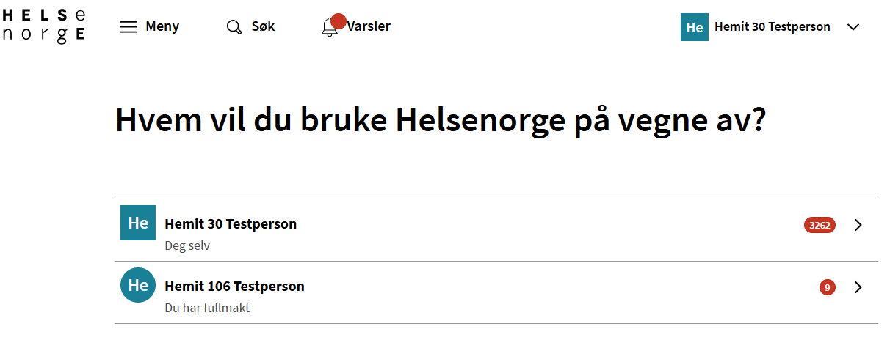

## Representasjon/"På vegne av" på helsenorge

Ved bestilling av skjema så vil ePROM spørre helsenorge om denne personen kan kontaktes på helsenorge.
Hvis det foreligger et representasjonsforhold på helsenorge eller personen kan kontaktes direkte, så vil skjema bli gjort tilgjengelig på helsenorge.

[Følgende representasjonsforhold er støttet på helsenorge](https://helsenorge.atlassian.net/wiki/spaces/HELSENORGE/pages/2520481794/Representasjon+p+Helsenorge#Hvilke-representasjonsforhold-er-st%C3%B8ttet-p%C3%A5-Helsenorge)

En bruker som kan representere andre på helsenorge vil etter innlogging få dette valget.

[Tilbake](./)
