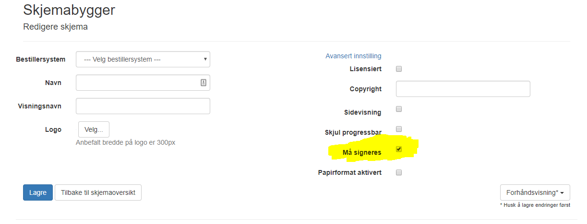
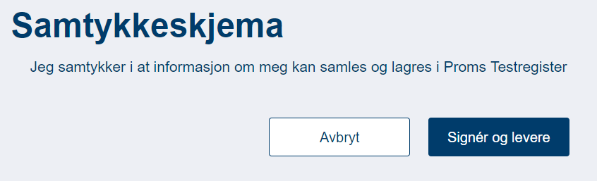

# SKJEMA SOM KREVER SIGNATUR

*Sist oppdatert 27.08.2019*

## Bestilling ##

Skjema som krever signatur bestilles av Bestillersystem på vanlig måte (se [BESTILLING AV SKJEMA](BestillingAvSkjemaV2)). For å angi at et skjema krever signatur må det hukes av for dette i skjemadesigneren (under *Avansert innstilling*) i ePROM Selvbetjeningsmodul: [https://proms2.hemit.org/PromsAdministration/](https://proms2.hemit.org/PromsAdministration/):



*NB! Skjema som krever signatur kan ikke bestilles med engangskode. Pasienten **må** logge inn med BankId ved utfylling.*

## Utfylling ##

Skjema som krever signatur fylles ut på samme måte som andre skjema av pasienten. Ved levering trykker pasienten på knappen *Signér og levere* i stedet for *Levere* som for andre skjema. Pasienten blir da tatt gjennom signeringsstegene før skjemaet blir levert.



## Mottak ##

Skjema som krever signatur leveres tilbake til Bestillersystem på vanlig måte (se [RETUR AV UTFYLT SKJEMA](ReturAvUtfyltSkjema)), men med en ekstra parameter *signedFormId*. Dette er en id som kan brukes av Bestillersystem for å laste ned det signerte dokumentet. Det signerte dokumentet er en PDF-fil av det utfyllte skjemaet samt en elektronisk signatur.

*NB! Bestillersystem er ansvarlig for at det signerte dokumentet blir lastet ned og at det blir oppbevart på en sikker måte. Det signerte dokumentet vil være tilgjengelig for nedlasting gjennom ePROM i minimum 30 dager.*

### Nedlasting av det signerte dokumentet ###

GET request mot: `<PromsApiBaseUrl>` /ExternalDocument/ `<SignedFormId>` 

`<PromsApiBaseUrl>` skal være *https://proms2.hemit.org/PromsWebApi*

**Send med ApiKey i request headeren**

``` 
Header name: authorization
Header value: Basic <ApiKey>
```

