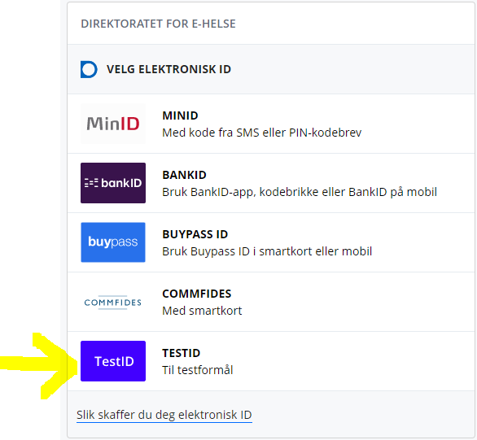

# Testpersoner

ePROM i testmiljøet integrerer med Helsenorge sine testmiljøer, og i alle miljø bortsett fra PROD er det **TEST-PREG** som benyttes.

For verifisering mot helsenorge kan alle fødselsnummmer i TEST-PREG benyttes, forutsatt at testpasienten
- ikke har status død
- er over 16 år
- har gitt samtykke på helsenorge

Samtykke gis ved første gangs innlogging til helsenorge. Velg samtykkenivå = Full:

Når samtykke er gitt vil skjemabestillinger leveres som en skjemaoppgave til pasienten i innboksen på helsenorge.

D-nummer kan også benyttes, med samme forutsetninger som for andre testpersoner

eHelse sitt testpersonverktøy [TestAbel](http://ehelsetestdata.azurewebsites.net/) kan brukes til å finne testpersoner, tilgang til dette gis av NHN. 

## Kontaktregisteret

Kontaktinformasjon i kontaktregisteret må oppdateres med jevne mellomrom. Dersom testpasienten ikke har oppdatert kontaktinformasjon siste 18 mnd regnes den som ikke digitalt aktiv selv om samtykke er gitt på helsenorge.

Ved innlogging på IdPorten får man derfor fra tid til annen spørsmål om kontaktinformasjon. Denne må fylles ut med telefonnummer og e-post, men dette må ikke være reell informasjon med mindre man ønsker å motta varslinger fra testmiljøet, f.eks. når testpasienten mottar nye skjemaoppgaver. 

## Innlogging i IdPorten

Ved innlogging i IdPorten i test, velg alternativ **TestID**. Fyll deretter inn fødselsnummer i feltet "Syntetisk personidentifikator (pid)" og trykk Autentiser. Man er da innlogget tilsvarende bankID nivå 4.

[Tilbake](./Integrasjonsguide)

