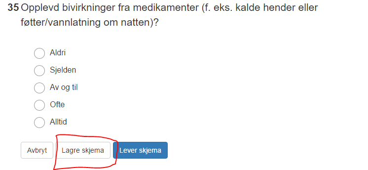
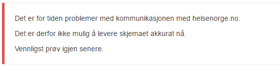
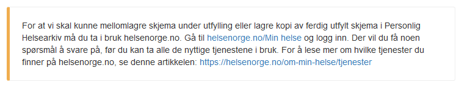
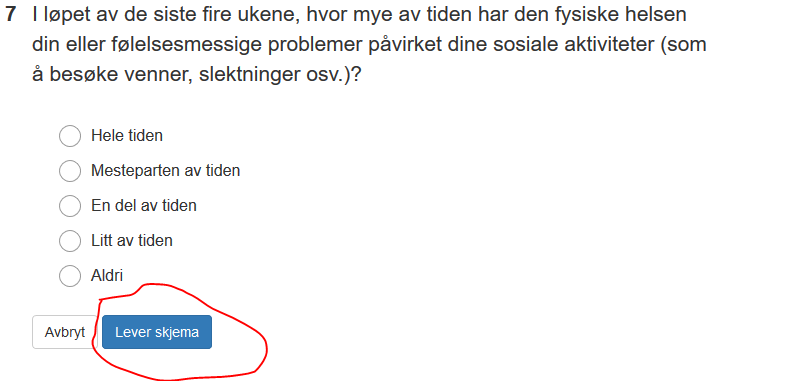

# Utfylling av skjema

*Gjelder v2.0 av PROMS*

*Sist oppdatert 23.08.2018*

## Innhold
[Helsenorge](#helsenorge)

[Digital Postkasse](#digital-postkasse)

[Pålogging](#pålogging)

### Helsenorge
Hvis pasienten er DigitaltAktiv på Helsenorge når PROMSskjemaet sendes ut får man tilgang til skjemaet via Helsenorge.

Når man åpner skjemaet via Helsenorge får man mulighet til å lagre skjemaet. Hvis man ikke ønsker å fylle ut alle spørsmålene i skjemaet kan man lagre skjema med de spørsmålene som er utfylt og åpne skjemaet ved en senere anledning og fortsette med utfyllingen. 

 
Når alle obligatoriske spørsmål er besvart leverer man skjema og man får kvitteringsmelding på at skjemaet er levert. Pasienten har nå tilgang til det utfylte skjemaet i sitt Personlige Helsearkiv hos Helsenorge.

Hvis det oppstår kommunikasjonssvikt mot Helsenorge vil det ikke være mulig å fylle ut og levere skjemaet. Feilmelding vises:

### Digital Postkasse
Hvis pasienten ikke er DigitaltAktiv på Helsenorge når POMRSskjemaet sendes ut får man tilgang til skjemaet via Digital Postkasse.

Når man åpner skjemaet får man litt informasjon om Helsenorge og Personlig Helsearkiv.

Ved utfylling av skjemaet vil pasienten nå ikke få muligheten til å lagre skjemaet før det er fullført. Pasienten må fylle ut alle obligatoriske spørsmål og levere skjemaet.

Når alle obligatoriske spørsmål er besvart leverer man skjema og man får kvitteringsmelding på at skjemaet er levert. Pasienten tilsendt det utfylte skjemaet til sin Digitale Postkasse.

### Pålogging
Utfylling av PROMsskjema krever pålogging med BankID – Nivå 4.

Logger man på Helsenorge og får tilgang til skjemaet her slipper ny pålogging for å fylle ut skjemaet.

Logger man på Digital Postkasse og får tilgang til skjemaet her må man logge på på nytt for å fylle ut skjemaet.
