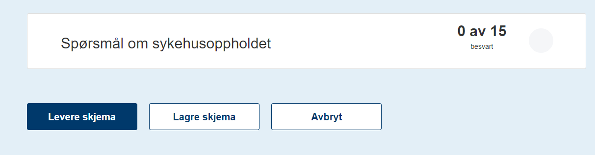

# Utfylling av skjema og varsling til pasienten

*Sist oppdatert 12.11.2021*

## Innhold
[Pålogging](#pålogging)

[Helsenorge](#helsenorge)

[Digital Postkasse](#digital-postkasse)

### Pålogging
Utfylling av PROMsskjema krever pålogging med BankID – Nivå 4. Dette gjelder alle varslingskanaler med unntak av engangskode. Her brukes fødselsdato og engangskode som gjelder for én skjemautfylling, og pasienten varsles ikke. 

Hvis man mottar skjema på helsenorge eller digipost og logger seg inn der for å se på skjemaoppgaven der vil man bli redirigert til skjemaet uten å måtte logge inn på nytt. 

### Helsenorge
Hvis pasienten er DigitaltAktiv på Helsenorge når pasientskjemaet sendes ut får man tilgang til skjemaet via Helsenorge.

Varsling til pasienten skjer via e-post, sms eller varsling i app, avhengig av hvilke innstillinger pasienten har i helsenorge.

Når man åpner skjemaet via Helsenorge får man mulighet til å mellomlagre skjemaet. Hvis man ikke ønsker å fylle ut alle spørsmålene i skjemaet kan man lagre skjema med de spørsmålene som er utfylt og åpne skjemaet ved en senere anledning og fortsette med utfyllingen. 

 
Når alle obligatoriske spørsmål er besvart leverer man skjema og man får kvitteringsmelding på at skjemaet er levert. Pasienten har nå tilgang til det utfylte skjemaet i sitt Personlige Helsearkiv hos Helsenorge.

### Digital Postkasse
Hvis pasienten ikke er DigitaltAktiv på Helsenorge når pasientskjemaet sendes ut får man tilgang til skjemaet via Digital Postkasse.

Varsling til pasienten skjer via e-post, sms eller varsling i app, avhengig av hvilke innstillinger pasienten har i sin digitale postkasse.

Ved utfylling av skjemaet vil pasienten nå ikke få muligheten til å lagre skjemaet før det er fullført. Pasienten må fylle ut alle obligatoriske spørsmål og levere skjemaet.

Når alle obligatoriske spørsmål er besvart leverer man skjema og man får kvitteringsmelding på at skjemaet er levert. Pasienten får tilsendt en kopi av det utfylte skjemaet til sin Digitale Postkasse.

### Usikker kanal

Hvis pasienten er registrert med kontaktinformasjon i Difi kontakt- og reservasjonsregister, men ikke er digitalt aktiv på helsenorge eller digipost, kan usikker kanal benyttes. Også har må pasienten logge inn med BankID nivå 4 for å fylle ut skjema. 

Pasienten mottar en lenke som går direkte til ePROM skjemautfyller. Ved utfylling av skjemaet vil pasienten nå ikke få muligheten til å lagre skjemaet før det er fullført. Pasienten må fylle ut alle obligatoriske spørsmål og levere skjemaet. Pasienten får ikke kopi av skjemaet.

Varsling skjer ved at det brukes en standard melding som ikke avslører sensitiv informasjon om hverken pasienten eller hvilket bestillersystem/register henvendelsen kommer fra. ("Usikker" gjenspeiler med andre ord at man kontaker pasienten på en kanal som ikke nødvendigvis er sikret fra pasientens side. Konsekvensen er at pasienten ikke nødvendigvis forstår hvorfor h\*n får henvendelsen)

NB: Usikker kanal bør brukes i minst mulig grad da det ikke nødvendigvis er sånn at en pasient har BankID nivå 4 selv om vedkommende er oppført i Kontaktregisteret.

### Papir

Hvis pasienten ikke er digitalt aktiv kan papirskjema være en mulighet. Da mottar pasienten et papirskjema i sin postkasse sammen med en ferdigadressert returkonvolutt. 

