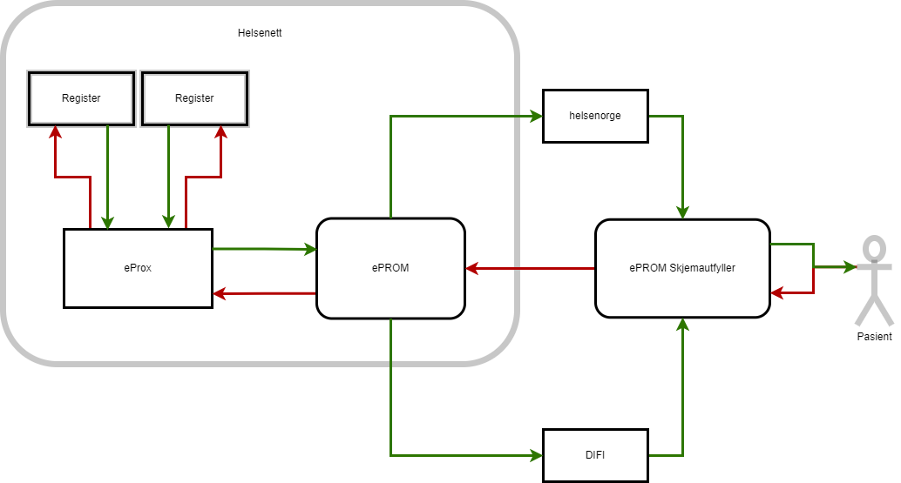

# ePROM proxy - ePROX

ePROM proxy - ePROX - gir muligheten for to eller flere bestillersystem til å samarbeide om bestilling av pasientskjema og mottak av av besvarte pasientskjema. 

Bakgrunnen for ePROX at det finnes flere registre med overlappende pasientgrupper. Det har ikke vært mulig å koordinere utsending av pasientskjema på tvers av registre, og det har ført til at pasienter får henvendelser flere ganger om samme hendelse/sykdomsforløp, eller at noen registre får lavere dekningsgrad enn nødvendig. 

ePROX vil gjøre det mulig for et register å koble seg på et annet registers bestilling, forutsatt at begge registre er konfigurert til å bruke ePROX.

- Registrene kommuniserer utelukkende med ePROX (ikke ePROM)
- ePROX er registrert som et helt vanlig bestillersystem i ePROM, og kommuniserer med ePROM via samme API som alle andre bestillersystemer.
- Skjema som er delt mellom registrene ligger i ePROM under ePROX bestillersystem sin skjemakatalog
- Registrene bestiller samme skjema (samme id), og bruker samme følgebrev og samme skjemainformasjon (f.eks. på helsenorge)
- Hver bestilling har en fast levetid. Denne er default på 365 dager. Etter dette vil ikke bestillingen være aktiv lenger, uansett hvilken status den har i ePROM (bestilt, levert, utløpt, feilet).

## Overordnet flytdiagram

### Bestilling av skjema som allerede er bestilt, men ikke besvart

Flytdiagrammet under viser hva som skjer når to registre bestiller samme skjema via ePROX. I dette tilfellet bestiller begge registre skjemaet før pasienten svarer. Begge registre kobles da til samme bestilling mot ePROM, og mottar svaret samtidig når/hvis pasienten velger å svare.  

### Bestilling av skjema som allerede er besvart

Flytdiagrammet under viser hva som skjer når to registre bestiller samme skjema via ePROX. I dette tilfellet bestiller register nr 2 skjemaet etter at pasienten har svart på bestillingen fra register 1. Register 2 vil da motta svaret umiddelbart. 

[ePROX i bruk](IntegrasjonOgBrukEProx)

[Tilbake](./)
