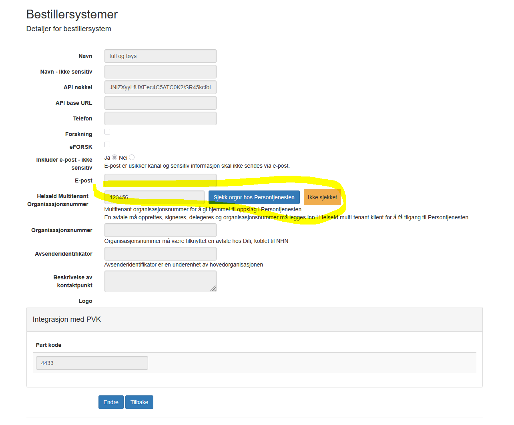

# Endringer i ePROM v13.3
*23.09.2025*

### Generelt
- ePROM v13.3 tar i bruk persontjenesten, dette pga at P-REG avvikles 31. desember 2025.  
  Avtale må opprettes, signeres, delegeres og organisasjonsnummer må legges inn i HelseId multi-tenant klient for å få tilgang til Persontjenesten.  
  Deretter må organisasjonsnummer legges inn på bestillersystemet i ePROM, da vil dette organisasjonsnummer brukes for dette bestillersystemet når det gjøres oppslag i persontjenesten.  

### Diverse
- Forbedret/utvidet logging.
- Endret slik at det ikke er er et krav å gjøre oppslag i persontjenesten/P-REG for utsending til Helsenorge og Digipost.
- Helsenorge [FinnFormidlingskanal API](https://helsenorge.atlassian.net/wiki/spaces/HELSENORGE/pages/1863024641/Finn+formidlingskanal) unntak feilkoder konfigurerbart i Octopus.
- Forbedringer i administrator modul.
  - Statistikksiden.
  - Testbestillinger.
  - Statuspanel.
  - Brukeradministrasjon.
  - Digipost virksomhet.

[Tilbake](./Releaselist) 