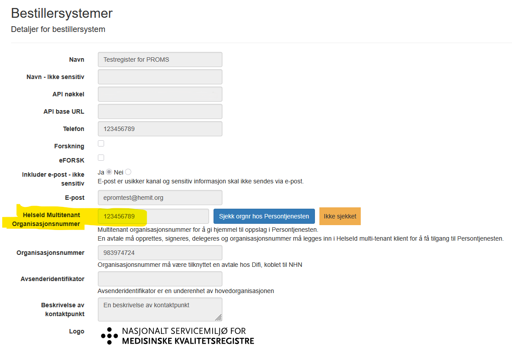

# Endringer i ePROM v13.3
*xxxx 2025*

### Generelt
- ePROM v13.3 tar i bruk persontjenesten, dette pga PREG avvikles 31. desember 2025.  
  Avtale må opprettes, signeres, delegeres og organisasjonsnummer må legges inn i HelseId multi-tenant klient for å få tilgang til Persontjenesten.  
  Deretter må organisasjonsnummer legges inn på bestillersystemet i ePROM, da vil dette organisasjonsnummer brukes for dette bestillersystemet når det gjøres oppslag i persontjenesten.  

### Diverse
- Forbedret/utvidet logging

[Tilbake](./Releaselist) 